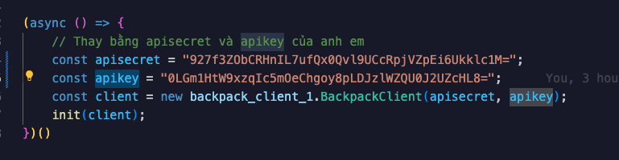

### Script farming dự án sàn cex Backpack (Farming script for BackPack Exchange)

source: https://financewire.com/2024/02/28/backpack-raises-17-million-strategic-series-a-round-led-by-placeholder-vc/

Nếu bạn chưa có tài khoản có thể sử dụng link ref của mình để ủng hộ, cảm ơn rất nhiều:
https://backpack.exchange/refer/airdrop101

### Thực hiện các bước sau (Follow bellow steps)

1. Cài đặt nodejs + vscode (install nodejs + vscode): https://youtu.be/YMwiiN557yg

2. Cài đặt thư viện (install libraries):

```
 npm install
```

3. Update apisecret, apikey

Truy cập https://backpack.exchange/settings -> API keys -> New API key và điền vào file index.js như hình ảnh.



4. Run script:

```
node ./index.js (windows)
node index.js (macos)
```

Mod: https://x.com/trangchongcheng

Twitter: https://x.com/airdrop101xyz

Website: https://airdrop101.xyz

Dont foget follow me, thank so much.
